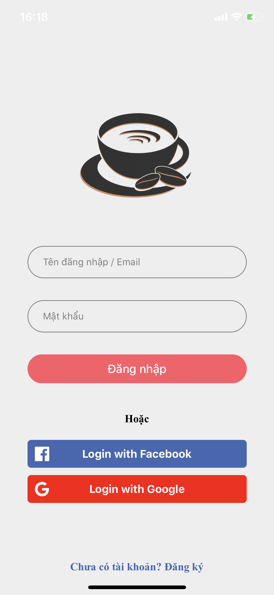
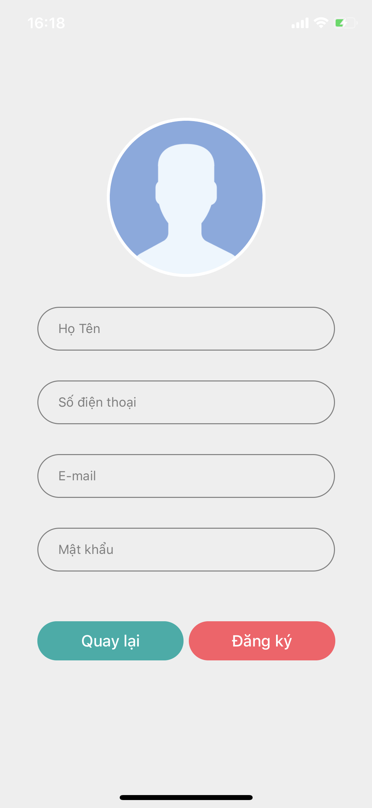
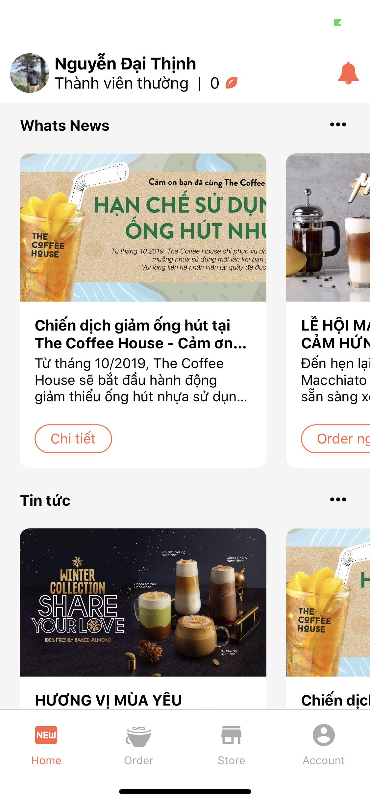
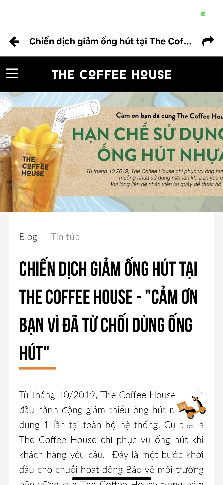
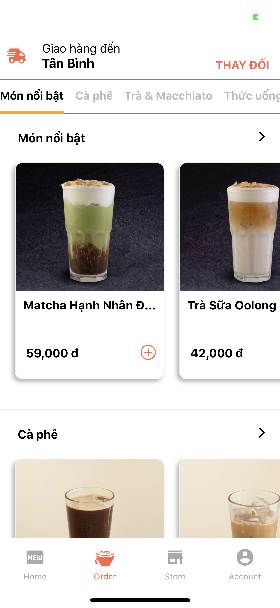
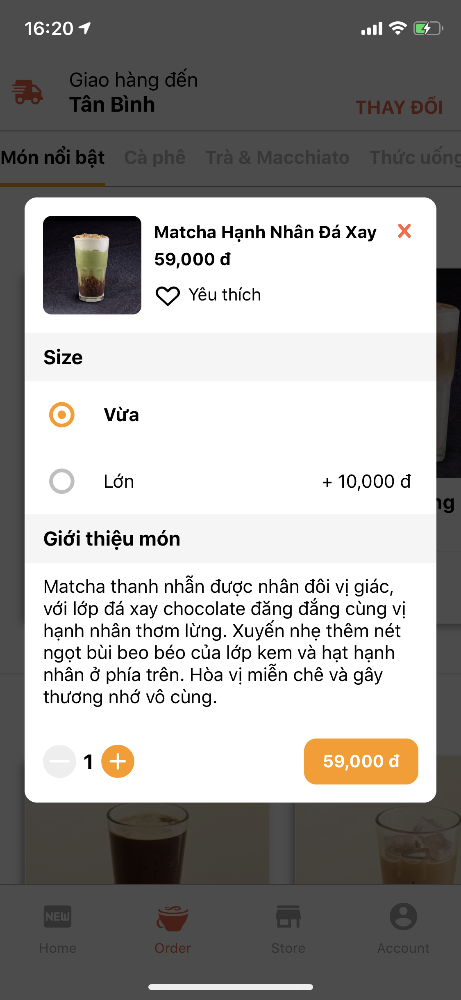
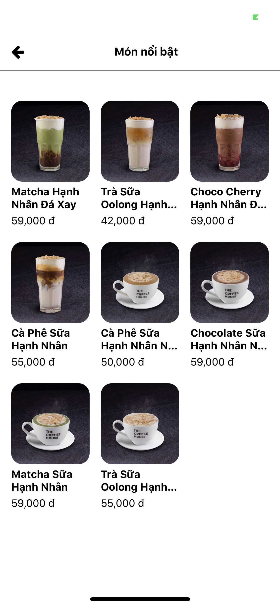
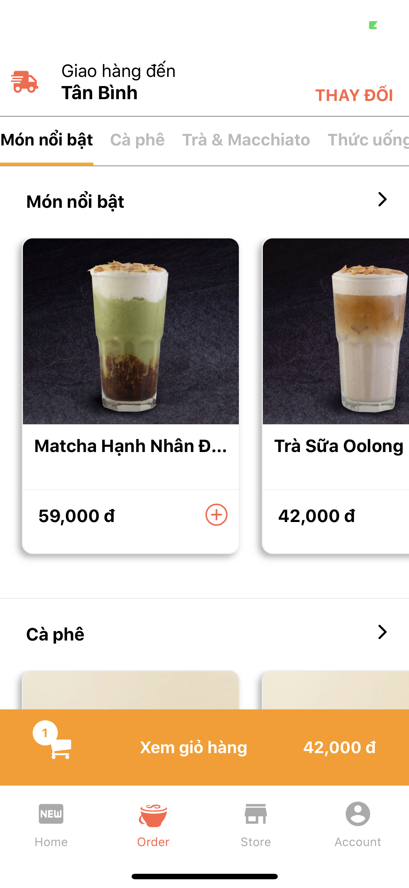
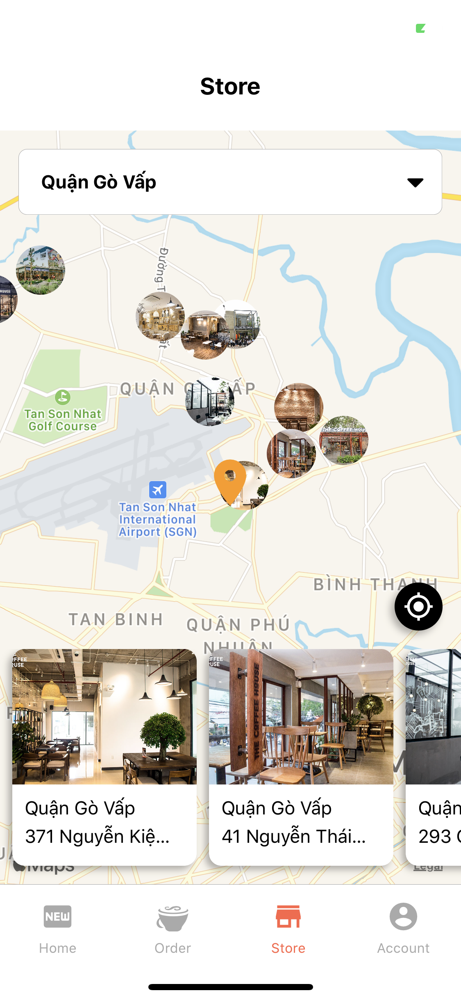
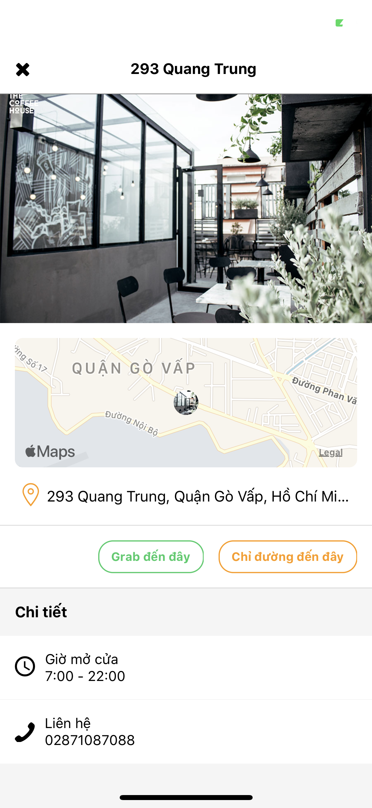

# MyCoffeeDemo

This is just a demo to practice how to make an app using React Native.  
All UI, behavior and dummy data will be imitated The Coffee House app.

## Getting Started
These instructions will get you a copy of the project up and running on your local machine for development and testing purposes. See deployment for notes on how to deploy the project.

### Prerequisites
This project using some service and api as below:
* [React Native Firebase](https://rnfirebase.io/docs/v5.x.x/getting-started)
* [Firebase Docs](https://firebase.google.com/docs/guides)
* [react-native-community/react-native-maps](https://github.com/react-native-community/react-native-maps)
* [react-native-community/react-native-google-signin](https://github.com/react-native-community/react-native-google-signin)
* [react-native-fbsdk](https://github.com/facebook/react-native-fbsdk)

Please refer the attached link for installation, generate API Keys for using in this project.  
The API keys should be store in path below to make source code work correctly  

Android:
* config.xml: ../android/app/src/main/res/values/config.xml (For GG Map API, FB App ID)

IOS:
* Config.swift: ../ios/Configs/ (For GG Map API)
* Info.plist: ../ios/MyReactDemo/Info.plist (For FB App ID)

### Installing
```
$ cd ../MyReactDemo
$ npm install
$ cd ios && pod install && cd ..
```

Above will install necessary module for project.

### Components
All library/components using in this project listed as below, please refer for using.
* [react-native-community/async-storage](https://github.com/react-native-community/async-storage)
* [react-native-event-listeners](https://www.npmjs.com/package/react-native-event-listeners)
* [react-native-fast-image](https://github.com/DylanVann/react-native-fast-image)
* [react-native-geolocation-service](https://github.com/Agontuk/react-native-geolocation-service)
* [react-native-image-picker](https://github.com/react-native-community/react-native-image-picker)
* [react-native-modal](https://facebook.github.io/react-native/docs/modal)
* [react-native-permissions](https://github.com/react-native-community/react-native-permissions)
* [react-native-reanimated](https://github.com/software-mansion/react-native-reanimated)
* [react-native-safe-area-context](https://github.com/th3rdwave/react-native-safe-area-context)
* [react-native-share](https://github.com/react-native-community/react-native-share)
* [react-native-vector-icons](https://github.com/oblador/react-native-vector-icons)
* [react-native-webview](https://github.com/react-native-community/react-native-webview)
* [react-navigation](https://reactnavigation.org/docs/en/getting-started.html)

### Test App
Project divided by Screen Component. (Path = "../MyReactDemo/source/")  

**ScreenAuth**  
 &nbsp;&nbsp;&nbsp;&nbsp;&nbsp;

<br /><br /><br /><br /><br />
**MainApp/AppController**  

<br /><br /><br /><br /><br />
**SubScreen**  

<br /><br /><br /><br /><br />
**ScreenOrder**  
 &nbsp;&nbsp;&nbsp;&nbsp;&nbsp;
 &nbsp;&nbsp;&nbsp;&nbsp;&nbsp;

<br /><br /><br /><br /><br />
**ScreenCart**  
 &nbsp;&nbsp;&nbsp;&nbsp;&nbsp;

<br /><br /><br /><br /><br />
**ScreenStore**  
 &nbsp;&nbsp;&nbsp;&nbsp;&nbsp;
 &nbsp;&nbsp;&nbsp;&nbsp;&nbsp;

<br /><br /><br /><br /><br />
## Authors
* **Thinh Nguyen** - [MyCoffeeDemo](https://github.com/daithinh2401/MyCoffeeDemo)
